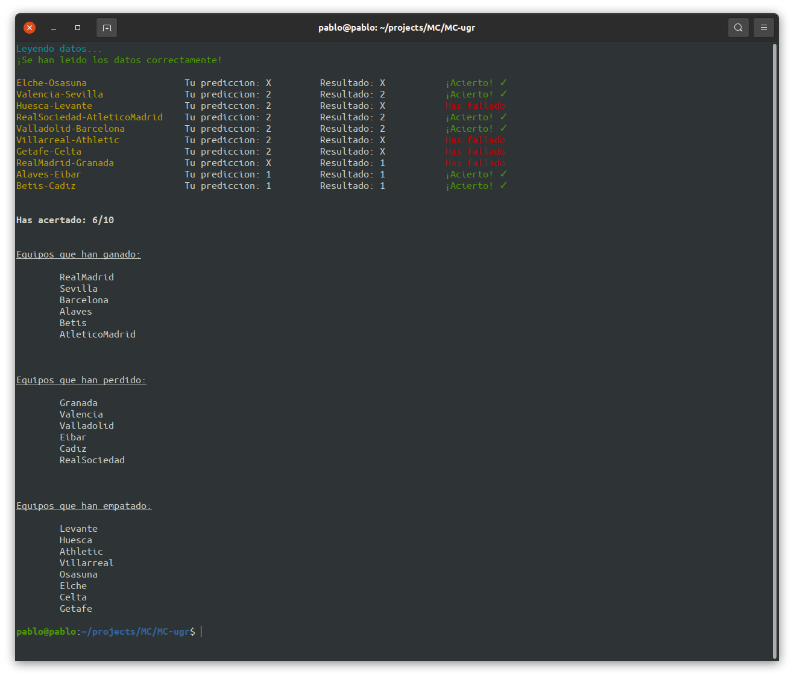
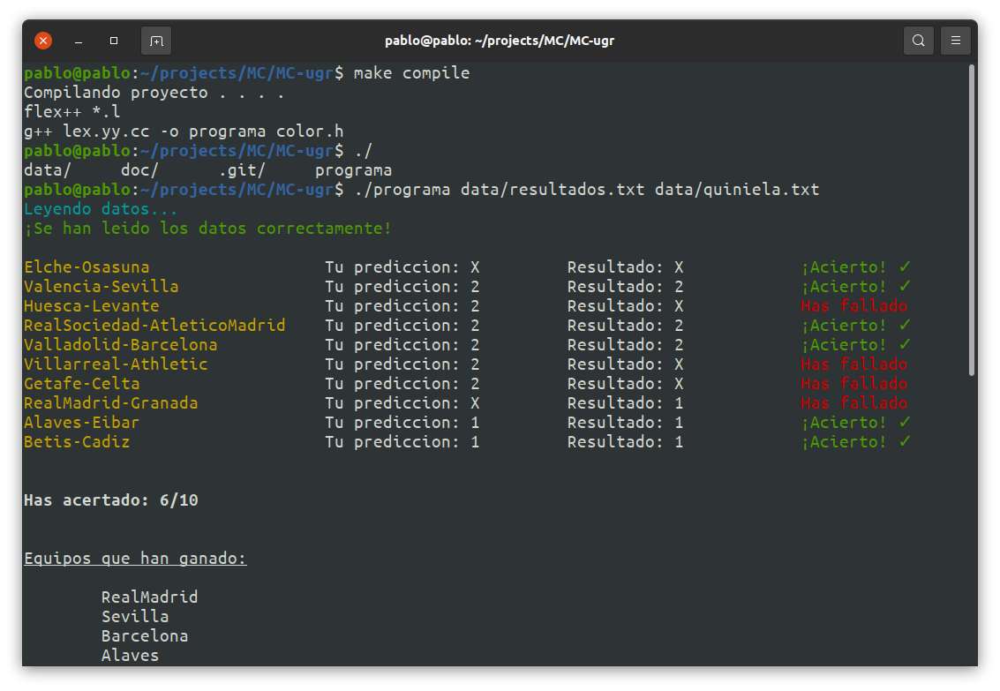

# Práctica 2. Expresiones Regulares con Flex++
-------------------------------------
Realizada por:
* [Ángel Cabeza Martín](https://github.com/angelcabeza)
* [Manuel Jurado Trillo](https://github.com/manujurado1)
* [Pablo Jiménez Jiménez](https://github.com/pablojj1808)

## 1. Descripción del problema abordado. 
El problema abordado consiste en un validador de quinielas de fútbol. 
Dada una quiniela en un fichero txt y los resultados de los partidos en otro txt, el programa comprueba la quiniela indicando los errores por partido y el cómputo final.

El orden en el que aparecen los partidos en `quiniela.txt` y en `partidos.txt` no tiene porque ser el mismo, el único requisito es que obviamente aparezcan los mismos partidos.

## 2. Explicación de cómo se ha abordado el problema.
Para obtener la información de los ficheros de entrada y almacenarla en las estructuras de datos para luego operar con los datos hacemos uso de las siguientes expresiones regulares:

`[-]`     : captura el delimiator de los nombres `<equipos>`-`<equipos>`

`X`       : solo captura cuando se lee el fichero quiniela, el empate.

`[a-zA-z]`: captura el nombre de los equipos.

`[" "]`   : captura los espacios para no incluirlos en los nombres.

`[0-9]`   : captura los números 1, 2 para la quiniela o la puntuación de los partidos.

`\n`      : nos sirve para capturar fin de linea y así limpiar los acumuladores de los nombres, es tambien en este punto cuando se almacena la nueva información en las estructuras de datos.
  
La información extraída de los ficheros de entrada se almacena en una estructura de datos de tipo: `vector< pair<string, char> >` que almacena los partidos que se enfrentan y el resultado de la apuesta (1: gana el primer equipo, 2: gana el segundo equipo, 3: empate). Esto se compara con la quiniela del usuario.
Finalmente, el programa vuelca los siguientes datos: corrige la quiniela, muestra los equipos ganadores de los partidos y muestra tus aciertos.


## 3. Un ejemplo de ejecución.
Haciendo uso del makefile podemos hacer directamente make y se ejecuta el programa con los ficheros de datos de prueba, si se quisieran pasar otros focheros, podemos hacer uso de la regla compile con `make compile` y lanzar el programa nosotros manualmente recordando que el primero parámetro es el fichero con los resultados de los partidos y el segundo es el de la quiniela.
Ejecucion con makefile


Compilación con makefile


## 4. Ficheros creados en la práctica.
``` txt
.
├── color.h
├── data
│   ├── quiniela.txt
│   └── resultados.txt
├── doc
│   ├── img
│   │   ├── 2.png
│   │   └── eje_programa.png
│   └── readme.md
├── Makefile
├── Memoria.pdf
└── solucion.l
3 directories, 8 files
```
- El fichero `color.h` para dar dinamismo a las salidas por consola.
- Los ficeros de `/data` son los ficheros de entrada del programa.
- El fichero `solucion.l` es el fichero lex.

##  5. Ficheros de entrada para el programa.
Se crean dos ficheros relacionados:
`quiniela.txt` con el formato `<equipo> <apuesta>` la apuesta puede ser **1** (gana el primer equipo), **2**(gana el segundo equipo) o **3** (empate).
`resultados.txt` con el formato `<equipo> <puntos> <equipo>`.

##  6. Compilar el programa
Hemos hecho un `Makefile` para facilitar la labor de compilación y ejecución.
Para compilar y ejecutar con los ficheros de prueba:
``` shell
$ make
```
Para compilar y ejecutar manualmente:
``` shell
$ make compile
```
Para limpiar el directorio:
``` shell
$ make clean
```
